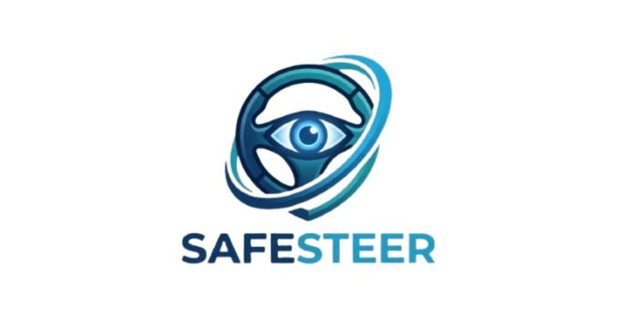

# SafeSteer: Advanced Driver Drowsiness Detection

SafeSteer is a high-performance, real-time driver safety system designed to detect drowsiness, fatigue, and head-drooping using state-of-the-art Computer Vision and Deep Learning.



## 🚀 Key Features

- **Hybrid AI Architecture**: Utilizes a combination of **CNN** (feature extraction) and **BiLSTM** (temporal pattern recognition) for 99.6% classification accuracy.
- **Modern Web Dashboard**: A premium, "Glassmorphism" designed real-time interface with live charts and fatigue telemetry.
- **Precision Tracking**: Powered by the **MediaPipe Tasks API (v2)** for low-latency facial landmarking.
- **Advanced Heuristics**: 
    - **Pitch Persistence**: Detects head-drooping even when the driver's face is partially obscured.
    - **Side-Look Suppression**: Intelligent Yaw-based logic to prevent false alerts while checking mirrors or talking to passengers.
    - **Baseline Adaptation**: Dynamic thresholding that adjusts to individual drivers and lighting conditions.

## 🛠 Project Structure

The project follows a modular, professional architecture:

```text
SafeSteer/
├── app.py              # Flask Web Server entry point
├── demo.py             # Local CLI/Desktop entry point
├── train.py            # Model training & evaluation pipeline
├── src/
│   ├── core/           # Detection engine and trainer logic
│   ├── data/           # Dataset loading and feature extraction
│   ├── models/         # Neural network architectures (CNN/BiLSTM)
│   └── utils/          # Automation and helper functions
├── templates/          # Web dashboard templates
└── static/             # Frontend assets (CSS, JS, Logo)
```

## 📊 Datasets

This project utilizes public datasets for training. To keep the repository lightweight, the datasets are not included in the source code. Please download them from the following links and place them in `data/raw/`:

- **[CEW Dataset](https://www.kaggle.com/datasets/ahamedfarouk/cew-dataset)** (Closed Eyes in the Wild)
- **[Driver Drowsiness Dataset (DDD)](https://www.kaggle.com/datasets/ismailnasri20/driver-drowsiness-dataset-ddd)**

## 📥 Installation

1. Clone the repository and navigate to the directory.
2. Ensure you have Python 3.10+ installed.
3. Install the dependencies:
   ```bash
   pip install -r requirements.txt
   ```

## 🚦 How to Use

### Option 1: Modern Web Dashboard (Recommended)
Launch the Flask-based dashboard for a premium real-time visualization:
```bash
python app.py
```
Then navigate to `http://127.0.0.1:5000` in your web browser.

### Option 2: Local CLI Demo
For a direct, low-overhead OpenCV window:
```bash
python demo.py
```

## 🧠 Technology Stack

- **Core**: Python, PyTorch, MediaPipe (Tasks API)
- **Web UI**: Flask, Vanilla CSS (Glassmorphism), Chart.js
- **Machine Learning**: Scikit-learn, Joblib (Feature Scaling)

## ⚖️ License
This project is for educational and safety advocacy purposes.
